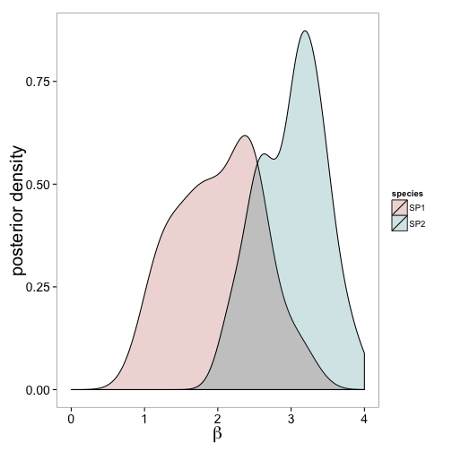
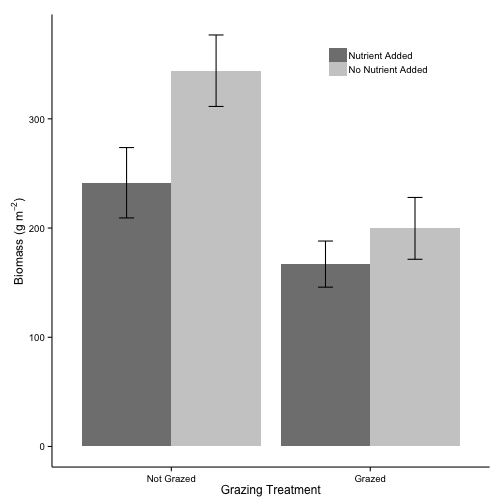
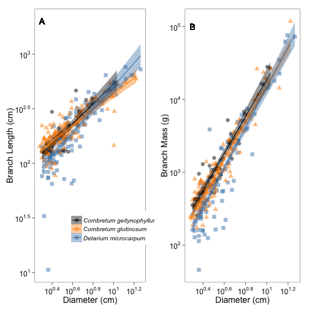
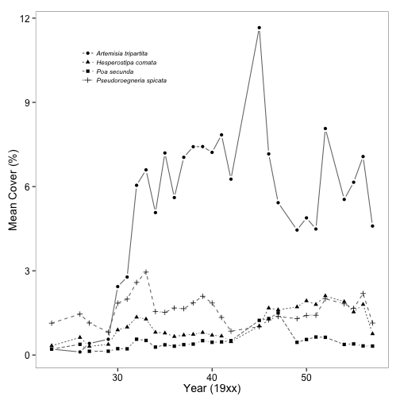
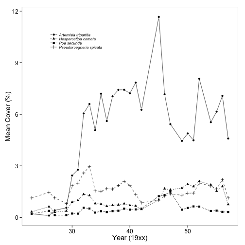
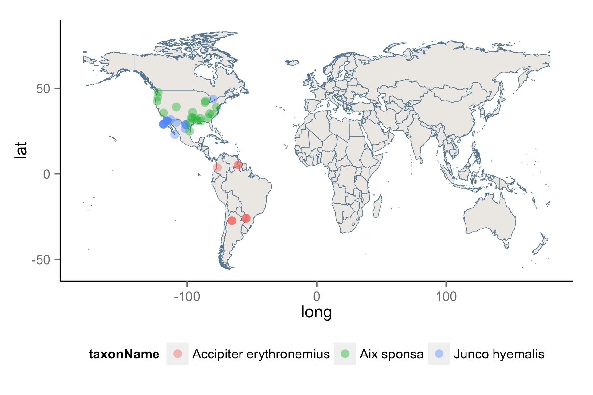

# Additional ggplot2 examples.
Here are several more example plots you can do with ggplot2.

* Distributions
* Error bars
* X-Y Scatter Allometry
* Time Series
* Maps
---


```coffee
# First we load up all the relevant libraries
library(ggplot2)
library(ggthemes)
library(grid)
library(gridExtra)
library(plyr)
library(scales)
# Install cshapes if you don't have it.  install.packages('cshapes')
```


# Overlapped distributions example

This is an example of how to make overlapping, transparent distributions using ggplot2. The data is fake, and just simulated within the code.


```coffee
dt <- rnorm(50, 2, 0.5)
dt2 <- rnorm(50, 3, 0.5)
dt.all <- c(dt, dt2)
sp <- c("SP1", "SP2")
data <- data.frame(species = factor(rep(sp, each = 50)), var1 = dt.all)
# The color-blind palette with grey:
cbPalette <- c("#999999", "#E69F00", "#56B4E9", "#009E73", "#F0E442", "#0072B2", 
    "#D55E00", "#CC79A7")
ggplot(data, aes(x = var1, fill = species)) + geom_density(alpha = 0.2) + xlab(expression(beta)) + 
    ylab("posterior density") + theme_bw() + scale_fill_hue(l = 40) + scale_x_continuous(limits = c(0, 
    4)) + theme(axis.title.x = element_text(size = 20), axis.title.y = element_text(size = 20, 
    angle = 90), axis.text.x = element_text(size = 14), axis.text.y = element_text(size = 14), 
    panel.grid.major = element_blank(), panel.grid.minor = element_blank())
```

 

---

# Error Bars

This R script shows an example of how to make grouped bar plots with error bars using ggplot2 
Also shows great use of 'plyr' for summarizing data


```coffee
#read in data (change 'datafile' to match your computer)
datafile <- "../data/GrazingData.csv"
data <- read.csv(file=datafile, header=TRUE)
head(data)
```

```
##   X biomass grazed nutadd
## 1 1   214.5      y      y
## 2 2   241.4      y      y
## 3 3   202.5      y      y
## 4 4   170.9      y      y
## 5 5   127.3      y      y
## 6 6   228.2      y      y
```

```coffee
#remove 'X' column
data <- data[,2:4]
head(data)
```

```
##   biomass grazed nutadd
## 1   214.5      y      y
## 2   241.4      y      y
## 3   202.5      y      y
## 4   170.9      y      y
## 5   127.3      y      y
## 6   228.2      y      y
```

```coffee

df.avg <- ddply(data, .(grazed, nutadd), summarize,
                mean.biomass = mean(biomass), 
                sd.biomass = sd(biomass))


#The bars and the errorbars will have different widths, so...
#we need to specify how wide the objects we are dodging are
dodge <- position_dodge(width=0.9)

#Create a sophisticated label for the y-axis
y.label <- expression(paste("Biomass (g ", m^-2, ")"))

#now start the plot
myplot <- ggplot(data=df.avg, aes(y=mean.biomass, x=grazed, fill=nutadd)) +
#adds the bars
 geom_bar(position=dodge, stat="identity") + 
 #adds the errorbars by adding/subtracting std. devs.
  geom_errorbar(position=dodge, aes(ymin=(mean.biomass-sd.biomass), 
                                    ymax=(mean.biomass+sd.biomass)),
                width=0.15)+ 
  #adds desired x and y axis labels
  ylab(y.label) + xlab("Grazing Treatment") + 
  #desired labels for x axis
  scale_x_discrete(labels=c("Not Grazed", "Grazed")) + 
  scale_fill_grey(start=0.5, end=0.8,
  	#set colors and labels for bar groups
labels = c("Nutrient Added", "No Nutrient Added")) + 
  #set theme from 'ggthemes'
  theme_classic() + 
  
  #add extra theme modifications
  theme(legend.position = c(0.75,0.9), #position legend in plot
        legend.title = element_blank(), #no legend title
        legend.key = element_blank(), #no legend ky
        legend.background = element_rect(colour = NA), #no legend background color
        legend.key.height = unit(5, "mm") #set height of legend (requires 'grid' library)
  ) 

#print plot to window
myplot
```

 

```coffee

#save the plot as a pdf (change file variable first)
file = "../data/Grazing.pdf"
ggsave(filename=file, plot=myplot, width=4, height=4, units="in")
```


---

# x-y scatterplot plot

This is an example of how to make a x-y scatterplot plot with linear model trend lines using ``ggplot2``. The plot semi-reproduces Figure 1 in Tredennick et al. 2013, _PLoS One_ (http://www.plosone.org/article/info%3Adoi%2F10.1371%2Fjournal.pone.0058241). The data is freely available on _Dryad_ ([http://datadryad.org/resource/doi:10.5061/dryad.4s1d2](http://datadryad.org/resource/doi:10.5061/dryad.4s1d2)).

The data contains measurements of biomass (total, stem, and leaf), length, and diameter for individual branches from savanna trees. Each observation is a branch, coded by species and tree. Here we'll just plot each observation by species and include a linear model fit for each species. We'll do two plots (diameter vs. length and diameter vs. total mass) and put them side-by-side for a publication-ready figure.

Geoms and other ``ggplot2`` commands used
---------------------------
* ``geom_point`` (``shape`` and ``color`` by category)
* ``geom_text``
* ``stat_line`` (``color`` by category)
* ``scale_colour_manual``
* ``scale_fill_manual``
* ``scale_y_log10`` and ``scale_x_log10``
* ``theme()``
* ``grid.arrange`` from the ``gridExtra``


```coffee
scatter_data <- read.csv("../data/AllometryData_Tredennick2013.csv")

names(scatter_data) <- tolower(names(scatter_data)) #change col names to lower case
scatter_data = scatter_data[scatter_data$aggregated_leaf_wt>-9000,] #take out bad data

scatter_data <- as.data.frame(scatter_data) #make it a data frame
head(scatter_data) #look at first lines
```

```
##       site                  spp site_code species tree tree_id branch
## 1 Tiendega Detarium microcarpum         1       1    1     FH1      1
## 2 Tiendega Detarium microcarpum         1       1    1     FH1      2
## 3 Tiendega Detarium microcarpum         1       1    1     FH1      3
## 4 Tiendega Detarium microcarpum         1       1    1     FH1      4
## 5 Tiendega Detarium microcarpum         1       1    1     FH1      5
## 6 Tiendega Detarium microcarpum         1       1    1     FH1      6
##   branch_id diameter length wood_wet_wt wood_ratio wood_dry_wt leaf_wet_wt
## 1        A2      2.6  120.1         425     0.5272       224.1         327
## 2        A3      3.2  173.4         700     0.5272       369.0         492
## 3        A1      5.1  227.1        2290     0.5272      1207.3         580
## 4        B1      3.8  171.2         550     0.5272       290.0         257
## 5        C1      3.3  183.8         990     0.5272       521.9         610
## 6        D1      2.4  136.6         260     0.5272       137.1         235
##   leaf_ratio leaf_dry_wt aggregated_wood_wt aggregated_leaf_wt total_mass
## 1     0.4516       147.7              224.1              147.7      371.7
## 2     0.4516       222.2              369.0              222.2      591.2
## 3     0.4516       261.9             1800.4              631.7     2432.1
## 4     0.4516       116.1              290.0              116.1      406.0
## 5     0.4516       275.5              521.9              275.5      797.4
## 6     0.4516       106.1              137.1              106.1      243.2
##     light light_sd fire  map   lat
## 1 -0.4148   0.0679 0.35 1400 11.04
## 2 -0.4148   0.0679 0.35 1400 11.04
## 3 -0.4148   0.0679 0.35 1400 11.04
## 4 -0.4148   0.0679 0.35 1400 11.04
## 5 -0.4148   0.0679 0.35 1400 11.04
## 6 -0.4148   0.0679 0.35 1400 11.04
```

```coffee


#Make a plot of diameter vs. length
length.plot <- ggplot(data=scatter_data, aes(x=diameter, y=length)) +
  geom_point(alpha=0.5, size=3, aes(color=spp, shape=spp)) +
  stat_smooth(method="lm", aes(color=spp, shape=spp, fill=spp)) + #add linear model fit and 95% CI
  scale_colour_manual(values = c("black", "darkorange", "steelblue")) + #set line and point colors
  scale_fill_manual(values = c("black", "darkorange", "steelblue")) + #set fill colors to match
  scale_y_log10(breaks = trans_breaks("log10", function(x) 10^x),
                labels = trans_format("log10", math_format(10^.x))) + #make log-log scale
  scale_x_log10(breaks = trans_breaks("log10", function(x) 10^x),
                labels = trans_format("log10", math_format(10^.x))) + #make log-log scale
  xlab("Diameter (cm)") + ylab("Branch Length (cm)") +
  geom_text(aes(2,2000,label = "A")) + #add text for panel ID
  theme_few() +
  theme(axis.title.x = element_text(size = 14),
        axis.title.y = element_text(size = 14, angle=90), 
        axis.text.x = element_text(size = 12), 
        axis.text.y = element_text(size = 12), 
        legend.position = c(0.72,0.2),
        legend.title = element_blank(),
        legend.key = element_blank(),
        legend.text=element_text(size=10, face="italic"),
        legend.background = element_rect(colour = NA),
        legend.key.height = unit(5, "mm"))

#make a plot of diameter vs. mass
mass.plot <- ggplot(data=scatter_data, aes(x=diameter, y=total_mass)) +
  geom_point(alpha=0.5, size=3, aes(color=spp, shape=spp)) +
  stat_smooth(method="lm", aes(color=spp, shape=spp, fill=spp)) + #add linear model fit and 95% CI
  scale_colour_manual(values = c("black", "darkorange", "steelblue")) + #set line and point colors
  scale_fill_manual(values = c("black", "darkorange", "steelblue")) + #set fill colors to match
  scale_y_log10(breaks = trans_breaks("log10", function(x) 10^x),
                labels = trans_format("log10", math_format(10^.x))) + #make log-log scale
  scale_x_log10(breaks = trans_breaks("log10", function(x) 10^x),
                labels = trans_format("log10", math_format(10^.x))) + #make log-log scale
  xlab("Diameter (cm)") + ylab("Branch Mass (g)") +
  geom_text(aes(2,100000,label = "B")) + #add text for panel ID
  theme_few() +
  theme(axis.title.x = element_text(size=14),
        axis.title.y = element_text(size=14, angle=90), 
        axis.text.x = element_text(size=12), 
        axis.text.y = element_text(size=12)) +
  guides(shape=FALSE, color=FALSE, fill=FALSE) #removes legend from second plot


final.fig <- grid.arrange(length.plot, mass.plot, ncol = 2)
```

 

```coffee
final.fig
```

```
## NULL
```


# Time series and plyr example

This is an example of how to make a time series plot using ggplot2 with data processed using plyr. The plot semi-reproduces Figure 1 in Adler et al. 2009, Ecology (http://www.esajournals.org/doi/full/10.1890/08-2241.1). The data is freely available on Ecological Archives (http://esapubs.org/archive/ecol/E091/243/default.htm).

There are two versions of this example: 
1) a 'Harder' example using the raw dataset with lots of plyr usage, and 
2) an 'Easier' example using a cleaned-up version of the dataset with more limited use of plyr. Both versions produce the same plot via the same ggplot2 commands.


## Easier


```coffee
data <- read.csv("../data/AdlerIdahoData_Dominants.csv")
# Convert 'data' to data frame for working with 'plyr' and 'ggplot2'
data <- as.data.frame(data)
# Average the cover over quads for each species, each year
quadout.df <- ddply(data, .(year, species), summarise, avg = mean(cover))
# Plot dominant species average cover through time Make linetype and shape
# vary by species, and add a gap between the line and datapoints by having
# two calls for geom_point (one white and larger than the the actual
# points to be plotted)
ggplot(data = quadout.df, aes(x = year, y = (avg * 100), linetype = species, 
    shape = species)) + geom_line(color = "grey45") + geom_point(color = "white", 
    size = 4) + geom_point(size = 2) + theme_bw() + xlab("Year (19xx)") + ylab("Mean Cover (%)") + 
    theme(axis.title.x = element_text(size = 14), axis.title.y = element_text(size = 14, 
        angle = 90), axis.text.x = element_text(size = 12), axis.text.y = element_text(size = 12), 
        panel.grid.major = element_blank(), panel.grid.minor = element_blank(), 
        legend.position = c(0.25, 0.85), legend.title = element_blank(), legend.key = element_blank(), 
        legend.text = element_text(size = 8, face = "italic"), legend.background = element_rect(colour = NA), 
        legend.key.height = unit(1, "mm"))
```

 


## Harder


```coffee
polydata.id <- read.csv("../data/Idaho_allrecords_cover.csv")
polydata.id <- as.data.frame(polydata.id)
polydata.id$species <- as.character(polydata.id$species)
# subset the data for columns of interest
data.id <- subset(polydata.id, select = c(quad, year, species, area))
data.id <- data.id[order(data.id$quad, data.id$year), ]
names(data.id)
```

```
## [1] "quad"    "year"    "species" "area"
```

```coffee
data.id <- data.id[data.id$year != 73, ]
# Separate out dominant species, skip this if not interested in just
# dominant species
dom.spp <- c("Poa secunda", "Artemisia tripartita", "Hesperostipa comata", "Pseudoroegneria spicata")
data.poa <- data.id[data.id$species == dom.spp[1], ]
data.art <- data.id[data.id$species == dom.spp[2], ]
data.hes <- data.id[data.id$species == dom.spp[3], ]
data.pse <- data.id[data.id$species == dom.spp[4], ]
data.dom <- rbind(data.poa, data.art, data.hes, data.pse)
data.dom <- data.dom[order(data.dom$quad, data.dom$year), ]
df.agg.dom <- ddply(data.dom, .(quad, year, species), summarise, sum = sum(area))
yrs <- sort(unique(df.agg.dom$year))
quads <- sort(unique(df.agg.dom$quad))
dat.all <- data.frame(quad = NA, year = NA, species = NA, sum = NA)
dat.quad <- data.frame(quad = NA, year = NA, species = NA, sum = NA)
# Add in zeros (0) for quads that have no record of a dominant species
for (i in 1:length(quads)) {
    dat.quad <- df.agg.dom[df.agg.dom$quad == quads[i], ]
    for (j in 1:length(yrs)) {
        dat.quadyr <- dat.quad[dat.quad$year == yrs[j], ]
        for (k in 1:length(dom.spp)) {
            ifelse(length(grep(dom.spp[k], dat.quadyr$species)) == 0, dat.quadyr <- rbind(dat.quadyr, 
                data.frame(quad = quads[i], year = yrs[j], species = dom.spp[k], 
                  sum = 0)), dat.quadyr <- dat.quadyr)
        }
        dat.quad <- rbind(dat.quad, dat.quadyr)
    }
    dat.all <- rbind(dat.all, dat.quad)
}
df.agg.dom <- dat.all[2:nrow(dat.all), ]
q1.df <- ddply(df.agg.dom, .(year, species), summarise, avg = mean(sum))
df.agg.domtot <- ddply(data.dom, .(quad, year), summarise, sum = sum(area))
df.agg.domavg <- ddply(df.agg.domtot, .(year), summarise, tot = (mean(sum) * 
    100))
## Plot dominant species average cover through time
ggplot(data = q1.df, aes(x = year, y = (avg * 100))) + geom_line(aes(linetype = species), 
    color = "grey45") + geom_point(aes(shape = species), color = "white", size = 3) + 
    geom_point(aes(shape = species), size = 2) + theme_bw() + xlab("Year (19xx)") + 
    ylab("Mean Cover (%)") + theme(axis.title.x = element_text(size = 14), axis.title.y = element_text(size = 14, 
    angle = 90), axis.text.x = element_text(size = 12), axis.text.y = element_text(size = 12), 
    panel.grid.major = element_blank(), panel.grid.minor = element_blank(), 
    legend.position = c(0.25, 0.85), legend.title = element_blank(), legend.key = element_blank(), 
    legend.text = element_text(size = 8, face = "italic"), legend.background = element_rect(colour = NA), 
    legend.key.height = unit(1, "mm"))
```

 


# Acquiring and mapping biodiversity data from the web 


```coffee
library(rgbif)
library(cshapes)
# Start with a list of species
splist <- c("Accipiter erythronemius", "Junco hyemalis", "Aix sponsa")
result <- occurrencelist_many(splist, coordinatestatus = TRUE, maxresults = 20)
result <- data.frame(result)
result$decimalLatitude <- as.numeric(result$decimalLatitude)
result$decimalLongitude <- as.numeric(result$decimalLongitude)
# Only keep rows that are complete
result <- result[complete.cases(result$decimalLatitude, result$decimalLatitude), 
    ]
# Remove bad points
result <- result[-(which(result$decimalLatitude <= 90 || result$decimalLongitude <= 
    180)), ]
# Grab a world map
world <- cshp(date = as.Date("2008-1-1"))
world.points <- fortify(world, region = "COWCODE")
result$taxonName <- as.factor(capwords(result$taxonName, onlyfirst = TRUE))
# Make a map
ggplot(world.points, aes(long, lat)) + geom_polygon(aes(group = group), fill = "#EEEBE7", 
    color = "#6989A0", size = 0.2) + geom_point(data = result, aes(decimalLongitude, 
    decimalLatitude, colour = taxonName), alpha = 0.4, size = 3) + theme(legend.position = "bottom")
```

 


